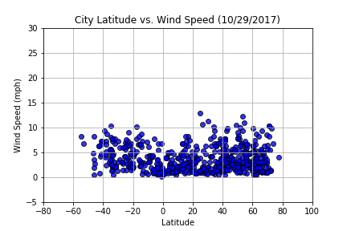

Unit 6 | Assignment - What's the Weather Like?

1.	Latitude is the measurement of the distance of a location on the Earth from the equator. From the Latitude vs Temperature chart, we can tell latitude is one of the main factors affecting temperature. The cities located between latitude from -20 to 20 have the highest temperatures. The further away from the equator the city temperature is lower. The northern temperature ranges are greater than the southern ranges at corresponding latitudes. The relative difference in the northern and southern hemispheres is greatest around 60° latitude where the southern hemisphere has almost no land. In general, places at high latitudes are colder than places at low latitudes.

                   
2.	From City Latitude vs Humidity chart, it doesn’t look like any direct relationship between latitude and humidity.  But apparently most of the cities are located in area with humidity over 60%. The reason is more people living the cities which require more water supply. So, cities are usually built by rivers, lakes, bay, or seashore. There are only very limited number of cities located in area with humidity below 20%.

3.	From City Latitude vs Wind Speed chart, we can tell most of cities are located in area with wind speed below 10mph. There is no city located in area with wind speed above 15mph. There is no direct relationship between wind speed and latitude. 

4. There is no direct relationship between Cloudiness and latitude.

